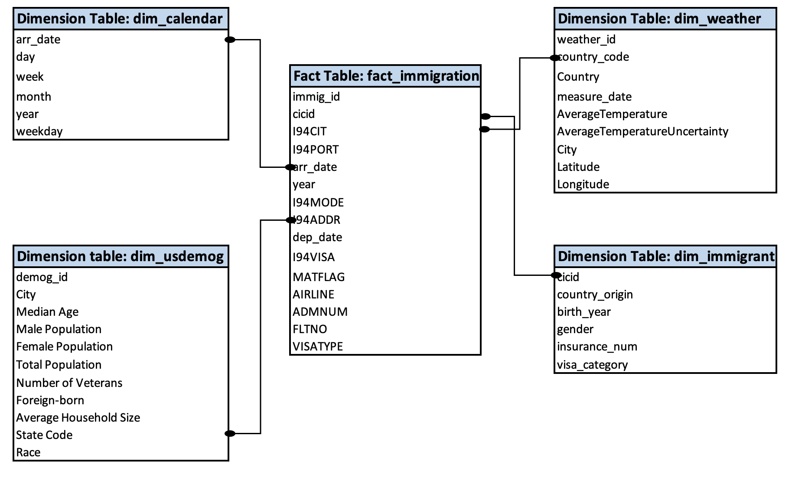

# Data Modeling for US immigration Department

## Introduction: US immigration Department and Their Analytical Goals

The US immigration Department has grown their immigration record database and wants to move their processes and analytical data onto the cloud. 

This project builds  an ETL pipeline that extracts US immigration Department data and other supporting data from variouys sources. This includes transforming data using Spark into a set of dimension and fact tables and loading it nto S3 for their analytics team to explore and find insights about US immigrants. 

Few key objectives of generating insight is as follows:
- enable more efficient and immigrant friendly
- identify process gaps and security gaps
- forecast resource capacity required by immigration department
- report important reports to various Federal bodies

## Source Data

### Main dataset: I94 Immigration Data: 
This data comes from the US National Tourism and Trade Office. This is where the data comes from [here](https://travel.trade.gov/research/reports/i94/historical/2016.html)

There's a file for each month of the year. An example file name is i94_apr16_sub.sas7bdat text. Each file has a three-letter abbreviation for the month name. So a full file path for June would look like this: ../../data/18-83510-I94-Data-2016/i94_jun16_sub.sas7bdat text. 

### Supporting Datasets:
#### World Temperature Data:
This dataset came from Kaggle. You can read more about it [here](https://www.kaggle.com/berkeleyearth/climate-change-earth-surface-temperature-data). This includes data about Global Land temepratures.

#### U.S. City Demographic Data: 
This data comes from OpenSoft. You can read more about it [here](https://public.opendatasoft.com/explore/dataset/us-cities-demographics/export/). This dataset contains information about the demographics of all US cities and census-designated places with a population greater or equal to 65,000. 

### Raw data Exploration:
#### Immigration data
- 3096313 records
- Several columns have null values: i94mode, 94addr, depdate, i94bir, visapost,occup, entdepa, entdepd, entdepu, matflag, biryear, dtaddto, gender, insnum, airline, fltno, dep_date
- Yougest member was born in 2019. But that is incorrect as the its a Apr 2016 set

#### US demographic data
- 2891 records
- All fields have 100% fill rates
- There are no duplicates
- Average household size is 2.3 which looks a bit low

#### Temperature Data
- 8235082 rows
- 364130 have null AverageTemperature and AverageTemperatureUncertainty
- All other field have 100% fill rate
- There are no duplicate rows
- Average temeperatir is 18 Degrees, with max being close to 40

## Data Model 

### Database Schema Design 

#### US immigration Department Data Star Schema

This Star Schema optimized for queries on Immigration patterns and analysis. This includes the following tables.

#### Fact Table
1. fact_immigration - records in I94 Immigration Data associated with immigration relate information
    - cicid, I94CIT, I94PORT, arr_date, I94MODE, I94ADDR, dep_date, I94VISA, MATFLAG, AIRLINE, ADMNUM, FLTNO VISATYPE
    - Primary key: cicid. Reason: Identifies rows uniquely. Created through the database object generator *Serial*

#### Dimension Tables
1. **dim_calendar** - timestamps of records in **fact_immigration** broken down into specific units
    - *arr_date, day, week, month, year, weekday*
    - Primary Key: arr_date. Reason: Identifies rows uniquely and is a natural Primary key as assigned by the raw data. 

2. **dim_weather** - songs in music database
    - *weather_id, country_code, Country_immigration, Country, measure_date, AverageTemperature, AverageTemperatureUncertainty, City Latitude, Longitude*
    - Primary key: weather_id. Reason: Identifies rows uniquely. Created through the  

3. **dim_immigrant** - demographich data about immigrants
    - *cicid, country_origin, birth_year, gender, insurance_num, visa_category*
    - Primary key: immig_id. Reason: Reason: Identifies rows uniquely. As assigned by the raw data in fact_immigration
    
4. **dim_usdemog** -  contains information about the demographics of all US cities and census-designated places with a population greater or equal to 65,000
    - *demog_id, City, Median Age, Male Population, Female Population, Total Population, Number of Veterans, Foreign-born, Average Household Size, State Code, Race*
    - Primary key: demog_id. Reason: Reason: Identifies rows uniquely. Created through the
    
5. **dim_us_state** - US state Code to State name mapping
    - *state_code, state*
    - Primary key: state_code. Natural Primary key as assigned by data
    
6. **dim_countrymapping** - Country COde to Country name mapping
    - *country_code, Country*
    - Primary key: country_code. Natural Primary key as assigned by data
    
7. **dim_port** -  Port Code to Post Name mapping
    - *port_code, port_name*
    - Primary key: port_code. Natural Primary key as assigned by data

#### Data Dictionary
Data dictionary can be found [here](Data_dictionary.csv). It contains the the following fields:
* Feature Name, Table Type, Table Name, Primary Key, Definition, Variable Type, Nullable

### Why Use Star Schema
With Star Schema there is no need for complex joins when querying data. This makes it very easy to use for business and BI teams. And as a results, queries also run faster as there are no elaborate joins. 

Its is also easy to understand once built and hence any modification is also simple

## ETL Pipeline
### Configure dl.cgf
1. Create am IAM role that has AmazonS3FullAccess and AdministratorAccess
2. In the dl.cfg files, add the access key and secret key without quotes

### ETL Pipeline
1. Open the Terminal Session
2. Run etl.py in the terminal through the following command: python etl.py. The script reads song_data and load_data from various sources as described above, transforms them to create five different tables, and writes them to partitioned parquet files in table directories on S3. 

The ETL pipeline effectively runs the following function to Extract Raw Data, Transform them into the Scehme and Load Modeled data to destination output:
- Step 1: process_extract_source_data (etl.py)
- Step 2: process_extract_mapping_data (etl.py)
- Step 3: quality_check.py
- Step 4: process_load_data (etl.py)

### Frequency of data update
The data should be update daily. This is because the fact table (fact_immigration) is at a daily granularity.

### Quality Checks
2 quality checks are performed:

1. Count checks to ensure completeness: checks if the output schema tables are empty
2. Integrity constraints on the relational database: primary key should not be null in any schema table

## Tool and Technology Used
Spark (PySpark and Spark SQL), Python, and AWS S3 has been used to build this ETL pipeline. 
* Since the ETL is done on big data, Spark provides the computing power through it Distributed processing framework. 
* The objective of this initiative is to able host the OLAP DB on the Cloud to enable improved accessibility, security and computing prower in downstream analytics workstream. AWS S3 enable this objective
* Python is the Easy to Use, Highly Compatible with other framworkds such as Spark and AWS, has lots of powerful libraries, and built in data stuctures which makes it a language of choice for data engineering.

## Approach to problem under different scenarios:
### The data was increased by 100x.
If the data is incresed by 100x, we will need more compute/processing power. This can be done by using using AWS EMR clusters. EMR simplifies running big data frameworks such as to process and analyze vast amounts of data.

### The data populates a dashboard that must be updated on a daily basis by 7am every day.
Airflow can be used for automated orchestration of data pipeline as in this case. Airflow DAG with appropriate start/end criteria will enable this

### The database needed to be accessed by 100+ people
We can shift to AWS Redshift to query as it provides high availability and limitless concurrency. This is also cost efficient as Redshift doesn't charge per query but by total query volume.